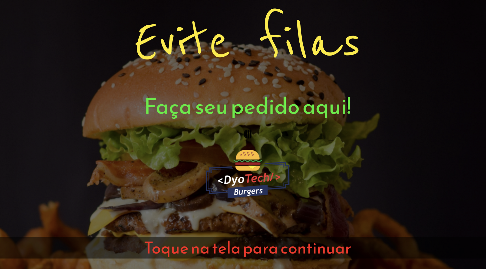
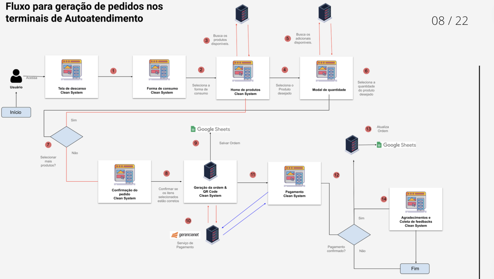

# Software para auto-atendimento



## 👨🏻‍💻 sobre o projeto

- <p style="color: red;">O projeto de Software para Auto-Atendimento foi desenvolvido como parte do Trabalho de Conclusão de Curso (TCC) e é um MVP para uma aplicação web destinada a totens de autoatendimento em fastfoods.</p>

## 🚀 Preview do projeto

<iframe width="560" height="315" src="https://www.youtube.com/embed/TW4cR6CUS30?si=Py4eBPxN91XQ9SCD" title="YouTube video player" frameborder="0" allow="accelerometer; autoplay; clipboard-write; encrypted-media; gyroscope; picture-in-picture; web-share" referrerpolicy="strict-origin-when-cross-origin" allowfullscreen></iframe>

## 🛠️ Arquitetura


</br  >


## 🚀 Tecnologias

Technologies that I used to develop this web client

- [ReactJS](https://reactjs.org/)
- [TypeScript](https://www.typescriptlang.org/)
- [React Router DOM](https://reacttraining.com/react-router/)
- [React Query]()
- [Material UI]()
- [Styled Components]()
- [React Hook Form]()
- [Yup]()

## 💻 Iniciando o projeto

**Clone o projeto e acesse a pasta**

```bash
$ git clone https://github.com/msalves008/React-Totem-FastFood-Prototipo.git && cd React-Totem-FastFood-Prototipo
```

**Siga os passos a baixo**

```bash
# Instalando as dependências
$ yarn install


# Iniciando o projeto
$ yarn start
```

---

Made with 💜 &nbsp;by Matheus Alves 👋 &nbsp;[See my linkedin](https://www.linkedin.com/in/msalves008)

## 👨‍💻 Criador

<table>
  <tr>
    <td align="center">
      <a href="#">
        <br>
        <sub>
          <b>Matheus Alves</b>
        </sub>
      </a>
    </td>   
   
  </tr>
</table>
